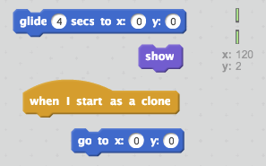

## Make the pipes move

Next you'll get the pipes moving across the screen to create an obstacle course.

+ Create a clone of your `Pipes` sprite every two seconds. Each clone should scroll across the stage from right to left (towards the parrot).

Tip: you can stop the pipes scrolling by clicking the red stop button.

--- hints --- --- hint ---
When the `green flag is clicked`, the `Pipes` sprite should `hide`. The sprite can then `create a clone` and `wait` for two seconds. This should be repeated `forever`.

`When started`, each clone should `go to` the right-hand side of the stage, `show` and then `glide` back towards the left of the stage before being `deleted`.
--- /hint --- --- hint ---
Here are the code blocks you'll need to create a clone every two seconds:

Here are the code blocks you'll need to make each clone move across the stage:

--- /hint --- --- hint ---
This is what your code should look like:

--- /hint --- --- /hints ---

+ Now you should have lots of pipes, but the gap is always in the same place. Add some variety by putting the gap between each set of pipes at a different height.

[[[generic-scratch-coordinates]]]

--- hints --- --- hint ---
Each newly created `clone` should `go to` a `random` `y position`. The clone should then glide across the stage, using the clone's `y position` to keep it moving in a straight line.
--- /hint --- --- hint ---
You'll need to use these two extra blocks:

--- /hint --- --- hint ---
This is what your code should look like:

--- /hint --- --- /hints ---
