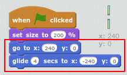
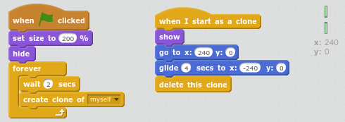
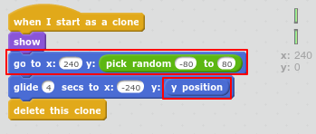

## Make the pipes move

Next you'll get the pipes moving across the screen to create an obstacle course. 

+ First let's get the pipes to start on the right of the screen and glide across to the left: 

    

+ Test your code and make sure the pipe slowly glide across to the left. 

+ That's one pair of pipes, but you want to keep them coming. You can use `clones` (copies) of a sprite. 

    Change your code so that it looks like this:

    
    
    Notice that the original sprite is hidden. 
    
+ Now you should have lots of pipes, but the gap is always in the same place. 

+ Let's add some variety by giving each pipe a random y position. 

    
    
    Notice that you need to set the y position to glide so that your pipes move in a straight line!
    
+ Test your project and make sure you have pipes moving across the stage with gaps at different heights. 

    
    
    

