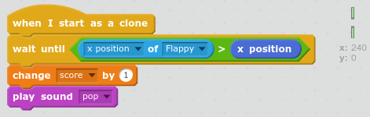

## Add scoring

The player should score a point every time Flappy makes it though a pipe. Let's add that next.

+ Make a new variable `For all sprites` and call it `score` {.blockorange}.

+ Each Pipes clone is going to `wait until` Flappy has flown past and then increase the score. 

    First, set the score to 0 when the game begins:
    
    

+ Then add the following code to the Pipes sprite:

    
    
+ Complete the code so that a point is scored, and a sound of your choice is played, when Flappy's x position is greater than `>` the Pipe's x position. 

--- hints ---
--- hint
You need to fill in the condition in the `wait until` {.blockcontrol} block to check for Flappy's __x position__ being __greater than >__ the __Pipes__ __x position__.  

You'll need to add blocks after the `wait until` {.blockcontrol} block to __change the score__ and __play a sound__. You could use the `pop` sound or add a sound from the library, `bird` works well.
--- /hint
--- hint
Try using these blocks:

--- /hint
--- hint
Your code should look like this. 

--- /hint
--- /hints ---

+ Test your code and make sure you score a point every time Flappy gets past an obstacle. Make sure the score goes back to zero when you start a new game. 

