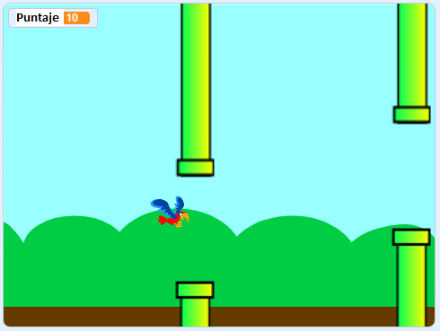

\--- no-print \---

Esta es la versión **Scratch 3** del proyecto. También hay una [versión del proyecto en Scratch 2](https://projects.raspberrypi.org/en/projects/flappy-parrot-scratch2).

\--- /no-print \---

## Introducción

Crea un juego en el que tengas que guiar a un papagayo entre las tuberías para ganar puntos.

### Lo que harás

\--- no-print \---

Haz clic en la bandera verde para comenzar el juego. ¡Pulsa la barra <kbd>espacio</kbd> para hacer que el loro agite sus alas, e intenta que vuele a través de los espacios entre las tuberías! Obtienes un punto cada vez que logres pasar al papagayo entre las tuberías.

  <iframe allowtransparency="true" width="485" height="402" src="https://scratch.mit.edu/projects/embed/258349724/?autostart=false" frameborder="0" scrolling="no"></iframe>
  

\--- /no-print \---

\--- print-only \---

Pulsarás la barra <kbd>espacio</kbd> para hacer que el papagayo agite sus alas y anotarás un punto cada vez que logres pasar al papagayo entre las tuberías.

\--- /print-only \---

## \--- collapse \---

## title: Lo que necesitarás

### Hardware

+ Un computador capaz de ejecutar el Scratch 3

### Software

+ Scratch 3 (ya sea [en línea](https://rpf.io/scratchon) o [sin conexión](https://rpf.io/scratchoff))

\--- /collapse \---

## \--- collapse \---

## title: Lo que aprenderás

+ Cómo crear objetos al usar el modo Vector
+ Cómo usar sonidos 
+ Cómo detectar colisiones
+ Cómo controlar un objeto al usar el teclado 

\--- /collapse \---

## \--- collapse \---

## título: Notas adicionales para educadores

\--- no-print \---

Si necesitas imprimir este proyecto, usa la [versión para imprimir](https://projects.raspberrypi.org/en/projects/flappy-parrot/print){:target="_blank"}.

\--- /no-print \---

Puedes [descargar el proyecto completo aquí](https://rpf.io/p/en/flappy-parrot-get).

\--- /collapse \---