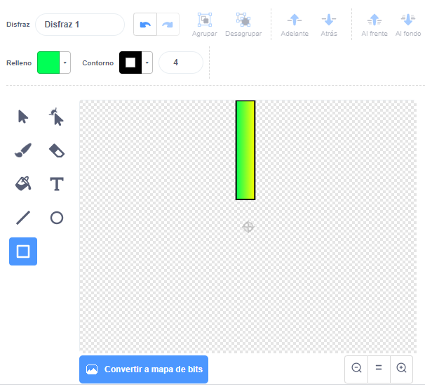
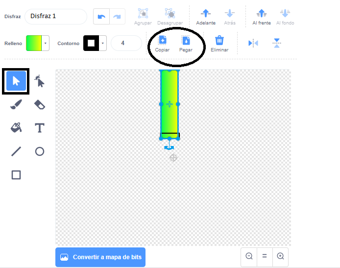

## Agrega las tuberías

Primero, crea las tuberías.

--- task ---

Abre un nuevo proyecto vacío de Scratch.

[[[generic-scratch3-new-project]]]

--- /task ---

--- task ---

Añade un fondo con un paisaje al aire libre. «Blue Sky» es una buena opción.


[[[generic-scratch3-backdrop-from-library]]]

--- /task ---

--- task ---

Crea un nuevo objeto y llámalo «Tuberías».

[[[generic-scratch3-draw-sprite]]]

--- /task ---

El objeto «Tuberías» debe tener un par de tuberías con un espacio en el medio. Al mover el objeto hacia arriba o hacia abajo, puedes poner el espacio en un lugar distinto.

Esta imagen muestra un ejemplo de cómo se pueden colocar las tuberías. Por lo general, las partes del objeto que están fuera del escenario se encuentran ocultas, solo las ves cuando arrastras el objeto:


Al dibujar un objeto no podrás conseguir que sea tan grande como las tuberías deben ser, pero puedes aumentar el tamaño como se muestra el objeto en el escenario.

--- task ---


Añade código para que el objeto sea más grande.

```blocks3
when green flag clicked
set size to (200) %
```

Esto hace que sea más fácil ver que tan grandes deben ser las tuberías.

--- /task ---

--- task ---

Dibuja un rectángulo para hacer la tubería superior, como se muestra aquí:



--- /task ---

--- task ---

Rellena la tubería con el color que quieras.


--- /task ---

--- task ---

Crea un duplicado de la tubería seleccionándola y luego haz clic en **Copiar** y **Pegar**.



--- /task ---

--- task ---

Arrastra la copia de la tubería a la parte inferior de la pantalla para que la copia esté alineada con la otra tubería. Debe haber un espacio entre las dos tuberías.


--- /task ---