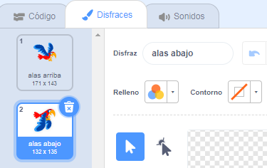

## Haz que Plumita vuele

Ahora harás que Plumita aletee al presionar la barra de <kbd>espacio</kbd>. Cuando juegues, debes cronometrar los tecleos necesarios para que Plumita atraviese los espacios entre las tuberías.

\--- no-print \---


\--- /no-print \---

Haz que Plumita vuele hacia arriba cuando toques la barra <kbd>espacio</kbd>.

\--- task \---

Cuando se presiona la tecla `espacio`{:class="block3events"}, Plumita debería moverse hacia arriba `al cambiar su coordenada y`{:class="block3motion"} a una pequeña cantidad, por ejemplo `6`.

Plumita vuela hacia arriba `al repetir`{:class="block3control"} este movimiento `10 veces`{:class="block3control"}.

Añade este código a tu objeto `Plumita`:


```blocks3
Al presionar la tecla (espacio v)
repetir (10) 
  cambiar y en (6)
fin
```

\--- /task \---

¡Ahora necesitas agitar las alas de Plumita!

\--- task \---

Haz clic en la pestaña **Disfraces** y llámalos: «alas hacia arriba» y «alas hacia abajo».



\--- /task \---

\--- task \---

¿Puedes hacer que el disfraz de Plumita cambie a `alas abajo` cuando presionas <kbd>espacio</kbd>, y luego que cambie devuelta a `alas arriba` a mitad del movimiento ascendente?

\--- hints \---

\--- hint \---

Necesitas dividir el movimiento ascendente a la mitad para poder usar dos bloques `repetir`{:class="block3control"} para cambiar el disfraz de Plumita al inicio y en el medio del movimiento.

Añade el bloque `cambiar disfraz a`{:class="block3looks"} para cambiar el aspecto de Plumita.

\--- /hint \--- \--- hint \---

Necesitas usar estos bloques:


```blocks3
repetir (5) 
  cambiar y en (6)
final

repetir (5) 
  cambiar y en (6)
final

cambiar disfraz a (alas arriba v)

cambiar disfraz a (alas abajo v)

al presionar la tecla [espacio v] 
```

\--- /hint \---

\--- hint \---

Tu código debería verse así:


```blocks3
al presionar la tecla [espacio v]
cambiar disfraz a (alas abajo v)
repetir (5) 
  cambiar y en (6)
final
cambiar disfraz a (alas arriba v)
repetir (5) 
  cambiar y en (6) 
fin
```

\--- /hint \---

\--- /hints \---

\--- /task \---

\--- task \---

Prueba tu código. Como ves, por el momento no pasa nada si dejas que Plumita golpee una tubería.

\--- /task \---