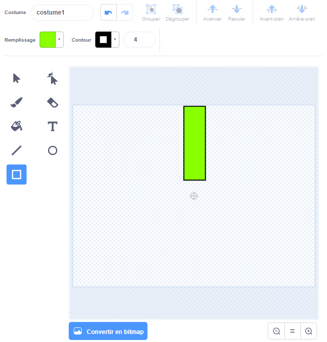

## Ajouter les tuyaux

Pour commencer, crée les tuyaux.

--- task ---

Ouvre un nouveau projet Scratch vide.

[[[generic-scratch3-new-project]]]

--- /task ---

--- task ---

Ajoute un arrière-plan avec un paysage. « Blue Sky » est un bon choix.


[[[generic-scratch3-backdrop-from-library]]]

--- /task ---

--- task ---

Crée un nouveau sprite et nomme-le « Tuyaux ».

[[[generic-scratch3-draw-sprite]]]

--- /task ---

Le sprite « Tuyaux » doit être une paire de tuyaux avec un espace au milieu. En déplaçant le sprite vers le haut ou vers le bas, tu peux placer l'espace à un autre endroit.

Cette image montre un exemple de la façon dont les tuyaux pourraient être positionnés. Les parties du sprite en dehors de la scène sont normalement masquées, tu les vois quand tu fais glisser le sprite :


Tu ne peux pas dessiner un sprite aussi grand que les tuyaux doivent l'être, mais tu peux augmenter la taille à laquelle le sprite apparaît sur la scène.

--- task ---


Ajoute du code pour agrandir le sprite.

```blocks3
when green flag clicked
mettre la taille à (200) % de la taille initiale
```

Cela permet de voir plus facilement la taille des tuyaux.

--- /task ---

--- task ---

Dessine un rectangle pour le tuyau supérieur comme indiqué ici :



--- /task ---

--- task ---

Remplis le tuyau par une couleur que tu aimes.


--- /task ---

--- task ---

Crée une copie du tuyau en le sélectionnant puis en cliquant sur **Copier** et **Coller**.


--- /task ---

--- task ---

Fais glisser la copie du tuyau vers le bas de l'écran afin que la copie soit alignée avec l'autre tuyau. Il doit y avoir un espace entre les deux tuyaux.


--- /task ---