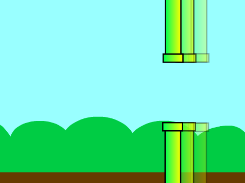

## Faire bouger les tuyaux

Maintenant, tu vas faire bouger les tuyaux sur l'écran pour créer un parcours d'obstacles.



\--- task \---

Commence par faire apparaître les tuyaux en ajoutant du code au sprite « Tuyaux » afin que, `quand le drapeau vert est cliqué`{:class="block3events"}, le sprite `répéter indéfiniment`{:class="block3control"} `crée un clone de lui-même`{:class="block3control"} toutes les deux secondes.


```blocks3
when green flag clicked
set size to (200) %
hide
forever 
  create clone of (myself v)
  wait (2) seconds
end
```

**Astuce :** les clones ne sont que des copies d'un sprite, et ils sont vraiment utiles pour créer des jeux.

\--- /task \---

\--- task \---

Fais bouger les tuyaux en ajoutant du code de sorte que, `quand un clone démarre`{:class="block3control"}, le clone apparaît sur le côté droit de la scène et `glisse`{:class="block3motion"} sur la gauche.


```blocks3
when I start as a clone
show
go to x: (240) y: (0)
glide (4) secs to x: (-240) y: (0)
delete this clone
```

**Astuce :** tu peux arrêter le défilement des tuyaux en cliquant sur le bouton rouge **stop** à côté du drapeau vert.

\--- /task \---

Maintenant, tu devrais avoir beaucoup de tuyaux, mais leurs espaces sont toujours au même endroit.

Tu peux ajouter de la variété en utilisant un nombre `aléatoire`{:class="block3operators"} pour l'`ordonnée y` du sprite « Tuyaux »{:class="block3motion"}.


\--- task \---

Modifie le code de ton sprite pour que chaque clone de sprite `choisis un nombre aléatoire entre -80 et 80`{:class="block3operators"} et `glisse`{:class="block3motion"} à cet `abscisse x`{:class="block3motion"} :


```blocks3
when I start as a clone
show
+ go to x: (240) y: (pick random (-80) to (80))
+ glide (4) secs to x: (-240) y: (y position)
delete this clone
```

\--- /task \---