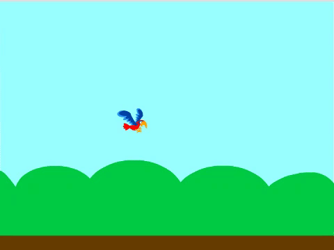

## Faire tomber Flappy

Maintenant, ajoute un sprite appelé « Flappy » et crée le code pour que Flappy tombe sur la scène. Dans l'étape suivante, tu ajouteras le code pour faire voler Flappy lorsque tu appuies sur une touche.

\--- no-print \---



\--- /no-print \---

\--- task \---

Ajoute un nouveau sprite qui a deux costumes, pour « ailes en haut » et « ailes en bas », et nomme-le `Flappy`.

Le sprite « Parrot » est un bon choix.


\--- /task \---

Flappy doit être plus petit.

\--- task \---

Ajoute du code pour `mettre la taille de Flappy à 25 %`{:class="block3looks"} `quand le drapeau vert est cliqué`{:class="block3events"}.


```blocks3
when green flag clicked
set size to (25) %
```

\--- /task \---

Lorsque le jeu commence, Flappy doit être juste à gauche du centre de la scène, aux coordonnées `-50, 0`.


\--- task \---

Ajoute du code pour que Flappy `se déplace à x et y`{:class="block3motion"} de la position de départ `x: -50`{:class="block3motion"} et `y: 0`{:class="block3motion "}.


```blocks3
when green flag clicked
set size to (25) %
+ go to x: (-50) y: (0)
```

[[[generic-scratch3-set-coordinates]]]

\--- /task \---

\--- task \---

Maintenant, fais en sorte que Flappy continue de tomber sur la scène `indéfiniment`{:class="block3control"} en `ajoutant -3 à l'ordonnée y du sprite`{:class="block3motion"}.


```blocks3
when green flag clicked
set size to (25) %
go to x: (-50) y: (0)
+ forever 
    change y by (-3)
end
```

\--- /task \---

\--- task \---

Teste ton code pour t'assurer que Flappy démarre au milieu de l'écran et tombe vers le bas. Lorsque tu fais glisser Flappy vers le haut de la scène, le sprite doit tomber à nouveau.

\--- /task \---