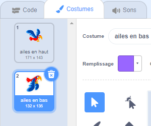

## Faire voler Flappy

Maintenant, tu vas faire voler Flappy vers le haut lorsque tu appuies sur la barre d'<kbd>espace</kbd>. Lorsque tu joues au jeu, tu dois contrôler tes tapotements pour faire passer Flappy entre les tuyaux.

\--- no-print \---


\--- /no-print \---

Fais voler Flappy vers le haut lorsque tu appuies sur la barre d'<kbd>espace</kbd>.

\--- task \---

Lorsque la `touche d'espace est pressée`{:class="block3events"}, Flappy doit se déplacer vers le haut en `ajoutant à l'ordonnée y`{:class="block3motion"} un petit nombre, par exemple `6`.

Flappy vole vers le haut en `répétant`{:class="block3control"} ce mouvement `10 fois`{:class="block3control"}.

Ajoute ce code à ton sprite `Flappy` :


```blocks3
when [space v] key pressed
repeat (10) 
  change y by (6)
end
```

\--- /task \---

Maintenant, tu dois faire battre les ailes de Flappy !

\--- task \---

Clique sur l'onglet **Costumes** et nomme les costumes de Flappy « ailes en haut » et « ailes en bas ».



\--- /task \---

\--- task \---

Peux-tu faire changer le costume de Flappy sur `ailes en bas` lorsque tu appuies sur la barre d'<kbd>espace</kbd>, puis le changer sur `ailes en haut` à mi-chemin ?

\--- hints \---

\--- hint \---

Tu dois diviser le mouvement vers le haut en deux afin de pouvoir utiliser deux `répéter`{:class="block3control"} pour changer le costume de Flappy au début et au milieu du mouvement.

Ajoute le bloc `basculer sur le costume`{:class="block3looks"} pour changer l'apparence de Flappy.

\--- /hint \--- \--- hint \---

Tu dois utiliser ces blocs :


```blocks3
répéter (5) fois
  ajouter (6) à y
fin

répéter (5) fois
  ajouter (6) à y
fin

basculer sur le costume (ailes en haut v)

basculer sur le costume (ailes en bas v)

quand la touche [espace v] est pressée
```

\--- /hint \---

\--- hint \---

Ton code devrait ressembler à ceci :


```blocks3
quand la touche [espace v] est pressée
basculer sur le costume (ailes en bas v)
répéter (5) fois
  ajouter (6) à y
fin
basculer sur le costume (ailes en haut v)
répéter (5) fois
  ajouter (6) à y
fin
```

\--- /hint \---

\--- /hints \---

\--- /task \---

\--- task \---

Teste ton code. Comme tu peux le voir, pour le moment, rien ne se passe si tu laisses Flappy toucher un tuyau.

\--- /task \---