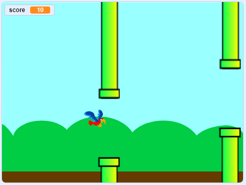

\--- no-print \---

यह इस प्रोजेक्ट का **Scratch 3** संस्करण है। [इस प्रोजेक्ट का Scratch 2 संस्करण](https://projects.raspberrypi.org/en/projects/flappy-parrot-scratch2) भी है।

\--- /no-print \---

## परिचय

एक गेम बनाएँ जिसमें अंक प्राप्त करने के लिए आपको स्क्रॉलिंग (घुमावदार) पाइपों से निकलने में तोते का मार्गदर्शन करना होगा।

### आप क्या बनाएँगे

\--- no-print \---

Click the green flag to start the game. Press the <kbd>space</kbd> bar to make the parrot flap its wings, and try to get it to fly through the gaps in the pipes! You score one point for every pipe that you manage to get the parrot past.

  <iframe allowtransparency="true" width="485" height="402" src="https://scratch.mit.edu/projects/embed/258349724/?autostart=false" frameborder="0" scrolling="no"></iframe>
  

\--- /no-print \---

\--- print-only \---

You will press the <kbd>space</kbd> bar to make the parrot flap its wings, and score one point for every pipe that you manage to get the parrot past.

\--- /print-only \---

## \--- collapse \---

## title: What you will need

### हार्डवेयर

+ Scratch 3 चलाने में सक्षम कंप्यूटर

### सॉफ्टवेयर

+ Scratch 3 ([ऑनलाइन](https://rpf.io/scratchon) या [ऑफ़लाइन](https://rpf.io/scratchoff))

\--- /collapse \---

## \--- collapse \---

## title: What you will learn

+ वेक्टर मोड का उपयोग करके स्प्राइट कैसे बनाएँ
+ ध्वनियों का उपयोग कैसे करें 
+ टकरावों का पता कैसे लगाएँ
+ कीबोर्ड का उपयोग करके स्प्राइट को कैसे नियंत्रित करें 

\--- /collapse \---

## \--- collapse \---

## title: Additional notes for educators

\--- no-print \---

If you need to print this project, please use the [printer-friendly version](https://projects.raspberrypi.org/en/projects/flappy-parrot/print){:target="_blank"}.

\--- /no-print \---

You can find the [completed project here](https://rpf.io/p/en/flappy-parrot-get).

\--- /collapse \---