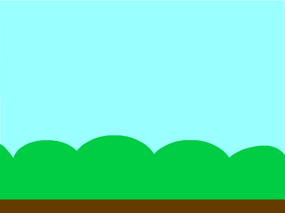
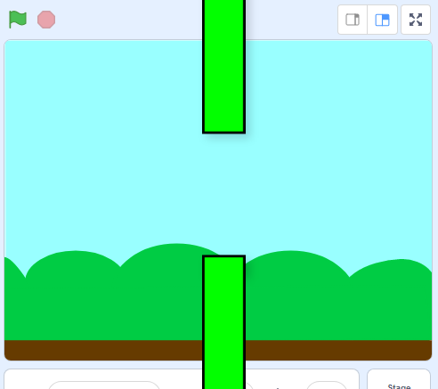
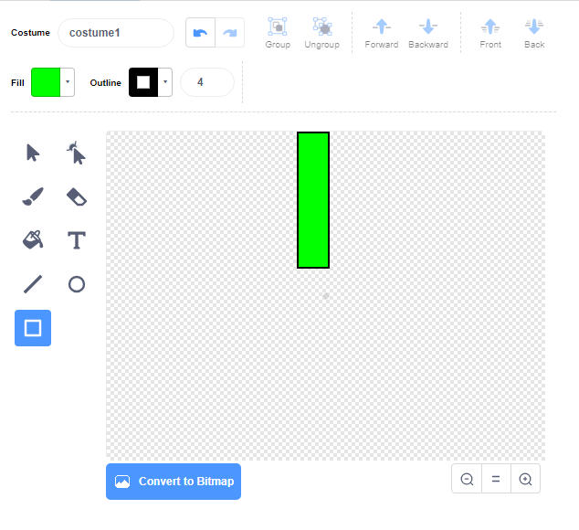
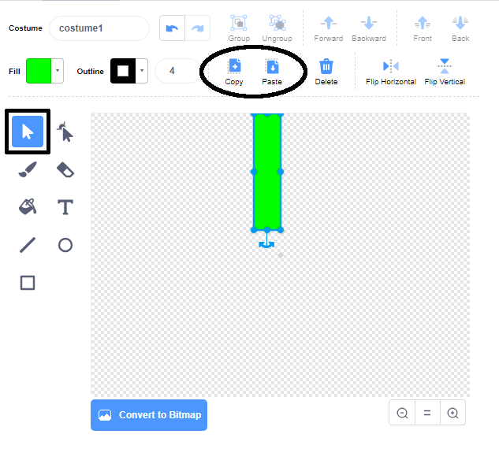
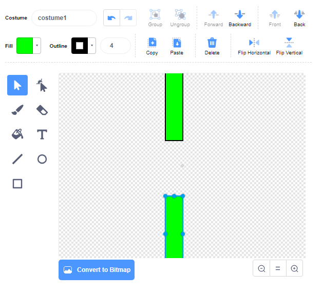

## पाइप जोड़ें

पहले, पाइप बनाएँ।

--- task ---

एक नई खाली Scratch परियोजना खोलें।

[[[generic-scratch3-new-project]]]

--- /task ---

--- task ---

एक बाहरी परिदृश्य के साथ कोई पृष्ठभूमि जोड़ें। 'ब्लू स्काई' (नीला आसमान) एक अच्छा विकल्प है।



[[[generic-scratch3-backdrop-from-library]]]

--- /task ---

--- task ---

एक नया sprite बनाएँ और इसका नाम 'Pipes' रखें।

[[[generic-scratch3-draw-sprite]]]

--- /task ---

'Pipes' sprite पाइपों की एक जोड़ी होनी चाहिए जिसके मध्य में खाली जगह हो। Sprite को ऊपर या नीचे ले जाकर, आप खाली जगह को किसी भिन्न स्थान पर रख सकते हैं।

इस चित्र में एक उदाहरण दिखाया गया है कि पाइप किस तरह रखे जा सकते हैं। स्टेज के बाहर sprite के हिस्से सामान्य रूप से छिपे होते हैं, आप इन्हें तभी देखते हैं जब आप sprite को खिसकाते हैं:



आप किसी sprite को उतना बड़ा नहीं खींच सकते जितना कि पाइपों को होना चाहिए, लेकिन आप उस आकार को उतना बढ़ा सकते हैं जितना sprite स्टेज पर दिखाता है।

--- task ---


Sprite को बड़ा करने के लिए कोड जोड़ें।

```blocks3
when green flag clicked
set size to (200) %
```

इससे यह देखना आसान हो जाता है कि पाइप कितने बड़े होने चाहिए।

--- /task ---

--- task ---

शीर्ष पाइप के लिए एक आयत बनाएँ जैसा कि यहाँ दिखाया गया है:



--- /task ---

--- task ---

पाइप में अपनी पसंद का रंग भरें।


--- /task ---

--- task ---

पाइप का डुप्लीकेट बनाने के लिए उसे चुनें और फिर **Copy** और **Paste** पर क्लिक करें।



--- /task ---

--- task ---

पाइप की कॉपी को स्क्रीन के नीचे तक खींचें ताकि कॉपी दूसरे पाइप के अनुरूप हो। दो पाइपों के बीच खाली जगह होनी चाहिए।



--- /task ---