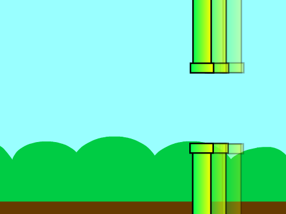

## पाइपों को चलाएँ

इसके बाद आप एक बाधा पथ बनाने के लिए पाइपों को स्क्रीन पर चलाने जा रहे हैं।



\--- task \---

पहले पाइप्स​ को दिखाने के पाइप्स sprite मे यह​ कोड जोडें, `when the green flag is clicked`{:class="block3events"}, sprite `forever`{:class="block3control"} हर दो सेकंड मे `creates a clone of itself`{:class="block3control"}


```blocks3
when green flag clicked
set size to (200) %
hide
forever 
  create clone of (myself v)
  wait (2) seconds
end
```

**सुझाव:** क्लोन किसी sprite की प्रतियाँ मात्र हैं, और वे गेम बनाने के लिए वास्तव में उपयोगी हैं।

\--- /task \---

\--- task \---

इसे बाद कोड जोड़कर पाइपों को चलाएँ ताकि, `when a clone starts`{:class="block3control"}, क्लोन स्टेज की दाईं ओर दिखाई दे और `glides`{:class="block3motion"} बाईं ओर ग्लाइड करे।


```blocks3
when I start as a clone
show
go to x: (240) y: (0)
glide (4) secs to x: (-240) y: (0)
delete this clone
```

**सुझाव:** आप हरे झंडे के आगे बने लाल **stop** (स्टॉप) बटन पर क्लिक करके पाइप को स्क्रॉल करने से रोक सकते हैं।

\--- /task \---

अब आपके पास बहुत सारे पाइप होने चाहिए, लेकिन उनके बीच खाली जगह हमेशा एक ही स्थान पर होगी।

आप पाइप स्प्राइट की `y position`{:class="block3motion"} के लिए `random`{:class="block3operators"} संख्या का उपयोग करके इसमें कुछ विविधता जोड़ सकते हैं।


\--- task \---

अपने sprite कोड को संशोधित करें ताकि प्रत्येक sprite क्लोन `picks a random number from -80 to 80`{:class="block3operators"} और `glides`{:class="block3motion"} करे `y position`{:class="block3motion"} तक​:


```blocks3
when I start as a clone
show
+ go to x: (240) y: (pick random (-80) to (80))
+ glide (4) secs to x: (-240) y: (y position)
delete this clone
```

\--- /task \---