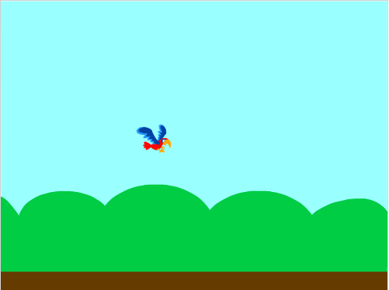

## मिट्ठू तोते को गिराएँ

अब Flappy (मिट्ठू तोता) नामक स्प्राइट जोड़ें और कोड बनाएँ ताकि Flappy स्टेज से नीचे गिर जाए। अगले चरण में, आप कोड जोड़ेंगे ताकि जब आप कोई कुंजी दबाएँ तो Flappy (तोता) उड़ने लग जाए।

\--- no-print \---


\--- /no-print \---

\--- task \---

एक नया स्प्राइट जोड़ें जिसमें दो परिधान हों, 'wings up' (पंख ऊपर) और 'wings down' (पंख नीचे) के लिए, और इसका नाम `Flappy` रखें।

तोता स्प्राइट एक अच्छा विकल्प है।


\--- /task \---

Flappy (तोता) छोटा होना चाहिए।

\--- task \---

`set Flappy's size to 25%`{:class="block3looks"} में कोड जोड़ें `when the green flag is clicked`{:class="block3events"}।


```blocks3
when green flag clicked
set size to (25) %
```

\--- /task \---

जब गेम शुरू होता है, तो Flappy (तोता) स्टेज के मध्य में थोड़ा बाईं ओर, निर्देशांक `-50, 0` पर होना चाहिए।



\--- task \---

Flappy (तोता) `go to the x and y`{:class="block3motion"} को `x: -50`{:class="block3motion"} और `y: 0`{:class="block3motion"} की प्रारंभिक स्थिति में जाने के लिए कोड जोड़ें।


```blocks3
when green flag clicked
set size to (25) %
+ go to x: (-50) y: (0)
```

[[[generic-scratch3-set-coordinates]]]

\--- /task \---

\--- task \---

अब Flappy (तोता) को `forever`{:class="block3control"} `changing the sprite's y position by -3`{:class="block3motion"} से स्टेज से गिरता रहने दें।


```blocks3
when green flag clicked
set size to (25) %
go to x: (-50) y: (0)
+ forever 
    change y by (-3)
end
```

\--- /task \---

\--- task \---

यह सुनिश्चित करने के लिए अपने कोड का परीक्षण करें कि Flappy (तोता) स्क्रीन के मध्य में शुरू होता है और नीचे तक गिरता है। जब आप Flappy (तोता) को खींच कर स्टेज के शीर्ष पर ले जाते हैं, तो स्प्राइट को फिर से गिरना चाहिए।

\--- /task \---