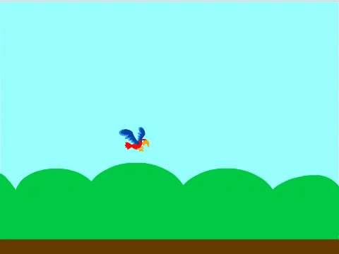
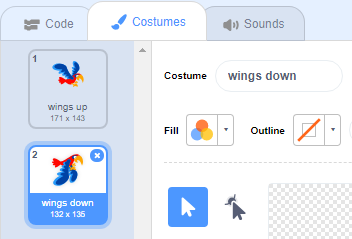

## फ्लैपी को उड़ाएँ

अब जब आप <kbd>space</kbd> बार को दबाएँगे तो आपका फ्लैपी ऊपर की तरफ उड़ेगा। जब आप गेम खेलते हैं, तो आपको अपने बटन दबाने के समय पर ध्यान देना होगा ताकि फ्लैपी पाइपों की खाली जगहों में से निकल सके।

--- no-print ---



--- /no-print ---

जब आप <kbd>space</kbd> बार को दबाएँगे तो फ्लैपी ऊपर की तरफ उड़ेगा।

--- task ---

`space key is pressed`{:class="block3events"} होने पर, फ्लैपी ऊपर उठेगा `changing its y coordinate`{:class="block3motion"} थोड़ा सा, उदाहरण के लिए `6`।

फ्लैपी ऊपर की ओर उड़ता है इस `repeating`{:class="block3control"} गतिविधि को `10 times`{:class="block3control"} बार करने पर।

इस कोड को अपने `Flappy` sprite में जोड़ें:


```blocks3
when [space v] key pressed
repeat (10) 
  change y by (6)
end
```

--- /task ---

अब आपको फ्लैपी के पंखों को फड़फड़ाना होगा!

--- task ---

**Costumes** टैब पर क्लिक करें, और फ्लैपी के costumes का नाम 'wings up' और 'wings down' रखें।



--- /task ---

--- task ---

क्या आप फ्लैपी के costume को बीच रास्ते ऊपर की ओर उड़ते समय <kbd>space</kbd> दबाकर `wings down` में, और फिर इसे वापस `wings up` में बदल सकते हैं?

--- hints ---


--- hint ---

आपको उर्ध्व गति को आधे हिस्से के रूप में बाँटना होगा ताकि आप फ्लैपी के costume को आरंभ में और बीच में बदलने के लिए दो `repeat`{:class="block3control"} खंडो का उपयोग कर सकें।

फ्लैपी कैसा दिखता है इसे बदलने के लिए `switch costume to`{:class="block3looks"} खंड जोड़ें।

--- /hint --- --- hint ---

आपको इन खंडो का उपयोग करने की आवश्यकता है:


```blocks3
repeat (5) 
  change y by (6)
end

repeat (5) 
  change y by (6)
end

switch costume to (wings up v)

switch costume to (wings down v)

when [space v] key pressed
```

--- /hint ---

--- hint ---

आपका कोड इस प्रकार दिखना चाहिए:


```blocks3
when [space v] key pressed
switch costume to (wings down v)
repeat (5) 
  change y by (6)
end
switch costume to (wings up v)
repeat (5) 
  change y by (6)
end
```

--- /hint ---

--- /hints ---

--- /task ---

--- task ---

अपने कोड का परीक्षण करें। जैसा कि आप देख रहे हैं, अगर आप फ्लैपी को पाइप से टकराने देते हैं तो इस समय कुछ भी नहीं होता है।

--- /task ---