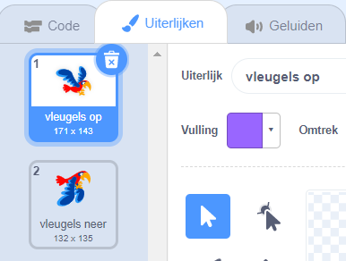

## Laat Flappy vliegen

Nu laat je Flappy's vleugels naar boven klappen zodra je op <kbd>spatiebalk</kbd> drukt. Wanneer je het spel speelt, moet je je toetsklikken timen om Flappy door de gaten in de pijpen te krijgen.

--- no-print ---


--- /no-print ---

Laat Flappy omhoog vliegen als je op de <kbd>spatiebalk</kbd> klikt.

--- task ---

Wanneer de `spatiebalk wordt ingedrukt`{:class="block3events"}, zou Flappy omhoog moeten gaan door `zijn y-coördinaat`{:class="block3motion"} een klein beetje te veranderen, bijvoorbeeld `6`.

Flappy vliegt omhoog door deze beweging `10 keer`{:class="block3control"} `te herhalen`{:class="block3control"}.

Voeg deze code toe aan je `Flappy` sprite:


```blocks3
wanneer [spatiebalk v] is ingedrukt
herhaal (10) 
  verander y met (6)
einde
```

--- /task ---

Nu moet je Flappy's vleugels laten fladderen!

--- task ---

Klik op het tabblad **Uiterlijken** en noem Flappy's kostuums 'vleugels op' en 'vleugels neer'.



--- /task ---

--- task ---

Kun je het uiterlijk van Flappy veranderen in `vleugels neer` als je op <kbd>spatiebalk</kbd> drukt, en dan terug naar `vleugels op` halverwege de opwaartse beweging?

--- hints ---


--- hint ---

Je moet de opwaartse beweging in tweeën delen, zodat je twee `herhaal`{:class="block3control"} blokken kunt gebruiken om Flappy's uiterlijk aan het begin en in het midden van de beweging te veranderen.

Voeg `verander uiterlijk naar`{:class="block3looks"} blokken toe om het uiterlijk van Flappy te wijzigen.

--- /hint --- --- hint ---

Je moet deze blokken gebruiken:


```blocks3
herhaal (5) 
  verander y met (6)
einde

herhaal (5) 
  verander y met (6)
einde

verander uiterlijk naar (vleugels op v)

verander uiterlijk naar (vleugels neer v)

wanneer [spatiebalk v] is ingedrukt
```

--- /hint ---

--- hint ---

Je code zou er als volgt uit moeten zien:


```blocks3
wanneer [spatiebalk v] is ingedrukt
verander uiterlijk naar (vleugels neer v)
herhaal (5) 
  verander y met (6)
einde
verander uiterlijk naar (vleugels op v)
herhaal (5) 
  verander y met (6)
einde
```

--- /hint ---

--- /hints ---

--- /task ---

--- task ---

Test je code. Zoals je ziet, gebeurt er momenteel niets als je Flappy een pijp laat raken.

--- /task ---