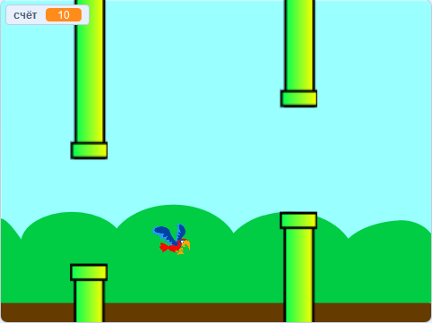

\--- no-print \---

Это версия проекта для **Scratch 3**. Есть также [версия для Scratch 2](https://projects.raspberrypi.org/en/projects/flappy-parrot-scratch2).

\--- /no-print \---

## Введение

Создай игру, в которой ты должен управлять попугаем, пролетающим мимо двигающихся труб, чтобы заработать очки.

### Что ты сделаешь

\--- no-print \---

Нажми на зеленый флаг, чтобы начать игру. Нажми клавишу <kbd>пробел</kbd>, чтобы попугай махал крыльями, и постарайся пролететь им через щели между труб! Ты получишь одно очко за каждую трубу, через которую тебе удастся провести попугая.

  <iframe allowtransparency="true" width="485" height="402" src="https://scratch.mit.edu/projects/embed/258349724/?autostart=false" frameborder="0" scrolling="no"></iframe>
  

\--- /no-print \---

\--- print-only \---

Ты будешь нажимать на клавишу <kbd>пробел</kbd>, чтобы попугай взмахивал крыльями, и наберёшь одно очко за каждую трубу, через которую тебе удастся провести попугая.

\--- /print-only \---

## \--- collapse \---

## title: Что тебе понадобится

### Оборудование

+ Компьютер, способный запускать Scratch 3

### Программное обеспечение

+ Scratch 3 ([онлайн](https://rpf.io/scratchon) или [автономный (offline)](https://rpf.io/scratchoff))

\--- /collapse \---

## \--- collapse \---

## title: Чему ты научишься

+ Как создать спрайты в векторном режиме
+ Как использовать звуки 
+ Как определить столкновения
+ Как управлять спрайтом с помощью клавиатуры 

\--- /collapse \---

## \--- collapse \---

## title: Дополнительные заметки для преподавателей

\--- no-print \---

Если вам нужно распечатать этот проект, пожалуйста, используйте [ версию для печати](https://projects.raspberrypi.org/en/projects/flappy-parrot/print) {:target="_blank"}.

\--- /no-print \---

Вы можете найти [завершенный проект здесь](https://rpf.io/p/en/flappy-parrot-get).

\--- /collapse \---