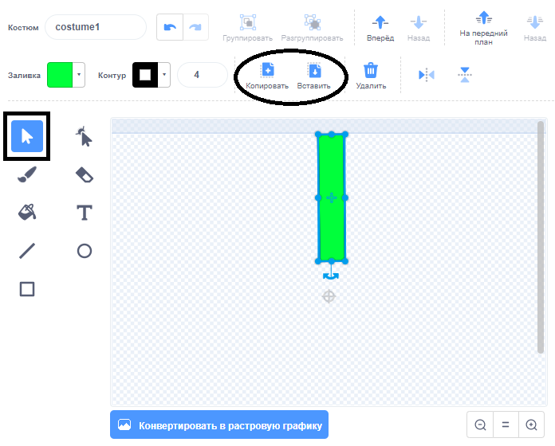
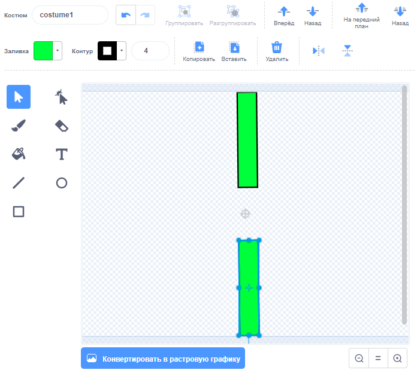

## Добавь трубы

Для начала создай трубы.

--- task ---

Открой новый пустой проект Scratch.

[[[generic-scratch3-new-project]]]

--- /task ---

--- task ---

Добавь фон с пейзажем на открытом воздухе. «Голубое небо (Blue Sky)» - хороший выбор.


[[[generic-scratch3-backdrop-from-library]]]

--- /task ---

--- task ---

Создай новый спрайт и назови его "Трубы".

[[[generic-scratch3-draw-sprite]]]

--- /task ---

Спрайт "Трубы" должен представлять собой пару труб с щелью посередине. Перемещая спрайт вверх или вниз, ты можешь поместить щель в другое место.

На этом рисунке показан пример того, как трубы могут быть расположены. Части спрайта за пределами Сцены обычно скрыты, ты видишь их только тогда, когда перемещаешь спрайт:


Ты не можешь нарисовать спрайт таким же большим, какими должны быть трубы, но ты можешь увеличить размер спрайта на Сцене.

--- task ---


Добавь код, чтобы увеличить спрайт.

```blocks3
when green flag clicked
set size to (200) %
```

Это облегчит понимание того, какими большими должны быть трубы.

--- /task ---

--- task ---

Нарисуй прямоугольник для верхней трубы, как показано здесь:


--- /task ---

--- task ---

Закрась трубу цветом, который тебе нравится.


--- /task ---

--- task ---

Создай дубликат трубы, выделив её и нажав **Копировать** и **Вставить**.



--- /task ---

--- task ---

Перетащи копию трубы в нижнюю часть экрана, так чтобы она находилась на одной линии с другой трубой. Между двумя трубами должна быть щель.



--- /task ---