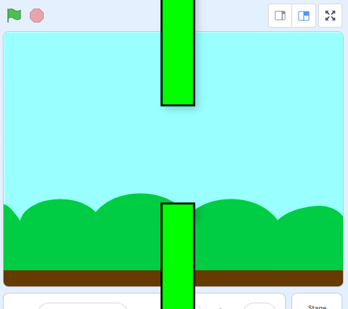

## Добавление труб

Для начала создай трубы.

\--- task \---

Открой новый пустой проект Scratch.

[[[generic-scratch3-new-project]]]

\--- /task \---

\--- task \---

Добавь фон с пейзажем на открытом воздухе. «Голубое небо (Blue Sky)» - хороший выбор.


[[[generic-scratch3-backdrop-from-library]]]

\--- /task \---

\--- task \---

Создай новый спрайт и назови его "Трубы".

[[[generic-scratch3-draw-sprite]]]

\--- /task \---

Спрайт "Трубы" должен представлять собой пару труб с зазором посередине. Перемещая спрайт вверх или вниз, ты можешь поместить зазор в другое место.

На этом рисунке показан пример того, как трубы могут быть расположены. Части спрайта за пределами Сцены обычно скрыты, ты видишь их только тогда, когда перетаскиваешь спрайт:



Ты не можешь нарисовать спрайт таким же большим, какими должны быть трубы, но ты можешь увеличить размер спрайта на Сцене.

\--- task \---


Добавь код, чтобы увеличить спрайт.

```blocks3
когда щёлкнут по зелёному флагу
установить размер (200) %
```

Это облегчит понимание того, какими большими должны быть трубы.

\--- /task \---

\--- task \---

Нарисуй прямоугольник для верхней трубы, как показано здесь:


\--- /task \---

\--- task \---

Закрась трубу цветом, который тебе нравится.


\--- /task \---

\--- task \---

Создай дубликат трубы, выделив её и нажав **Копировать** и **Вставить**.


\--- /task \---

\--- task \---

Перетащи копию трубы в нижнюю часть экрана, чтобы копия находилась на одной линии с другой трубой. Между двумя трубами должен быть зазор.


\--- /task \---