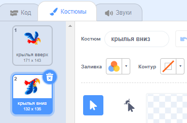

## Сделай Flappy летающим

Теперь ты сделаешь, так что Flappy будет махать крыльями и лететь вверх, при нажатии клавиши <kbd>Пробел</kbd>. Когда ты играешь в игру, тебе нужно рассчитывать время нажатий так, чтобы у Flappy получалось пролетать между трубами.

\--- no-print \---


\--- /no-print \---

Заставь Flappy лететь вверх, когда ты нажимаешь на клавишу <kbd>пробел</kbd>.

\--- task \---

Когда `клавиша пробел нажата`{: class = "block3events"}, Flappy должен двигаться вверх, `изменяя свою координату y`{: class = "block3motion"} на небольшое значение, например `6`.

Flappy летит вверх, `повторяя`{: class = "block3control"} это движение `10 раз`{: Класс = "block3control"}.

Добавь этот код в свой спрайт `Flappy`:


```blocks3
когда клавиша [space v] нажата
повторить (10) раз 
  изменить y на (6)
end
```

\--- /task \---

Теперь тебе нужно сделать так, чтобы Flappy махал крыльями!

\--- task \---

Нажми на вкладку **Костюмы** и назови костюмы Flappy 'крылья вверх' и 'крылья вниз'.



\--- /task \---

\--- task \---

Можешь ли ты сделать смену костюма Flappy на `крылья вниз` при нажатии <kbd>пробела</kbd>, и затем снова изменить его на `крылья вверх` на полпути движения вверх?

\--- hints \---

\--- hint \---

Тебе нужно разделить движение вверх пополам, чтобы можно было использовать два блока `повторить`{:class="block3control"}, чтобы изменять костюм Flappy в начале и в середине движения.

Добавь блоки`переключить костюм на`{:class="block3looks"}, чтобы изменить внешний вид Flappy.

\--- /hint \--- \--- hint \---

Тебе нужно использовать эти блоки:


```blocks3
повторить (5) раз 
  изменить y на (6)
end

повторить (5) раз 
  изменить y на (6)
end

изменить костюм на (крылья вверх v)

изменить костюм на (крылья вниз v)

когда клавиша [пробел v] нажата
```

\--- /hint \---

\--- hint \---

Твой код должен выглядеть так:


```blocks3
когда клавиша [пробел v] нажата
изменить костюм на (крылья вниз v)
повторить (5) раз 
  изменить y на (6)
end
изменить костюм на (крылья вверх v)
повторить (5) раз 
  изменить y на (6)
end
```

\--- /hint \---

\--- /hints \---

\--- /task \---

\--- task \---

Проверь свою программу. Как ты видишь, пока что ничего не происходит, когда Flappy ударяется об трубу.

\--- /task \---